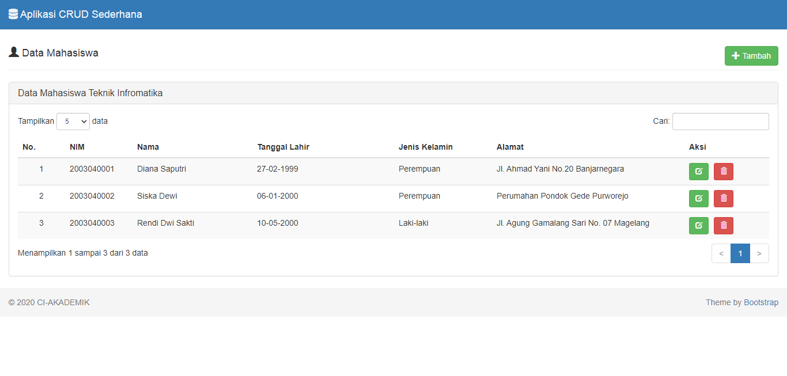

# Website CRUD Sederhana PHP dengan konsep OOP (Object Oriented Programming)

Website ini adalah hasil dari dari mata kuliah Pemrograman Web Lanjut

# Fitur :

**1. Create**
**2. Read**
**3. Update**
**4. Delete**

# Website ini dibangun dengan :

1. PHP Native
2. MySql
3. Boostrap
4. Sweetalert

# Instalasi :

1. Download source code
2. Ekstrak source code
3. Pindahkan folder **crud-php-oop** ke **c:/xampp/htdocs/..disini..**
4. Jalankan server (bisa menggunakan xampp)
5. Import file **database.sql** yang terdapat pada folder **database** ke MySql
6. Ketikan ke url browser **localhost/crud-php-oop** maka akan muncul tampilan awalnya
